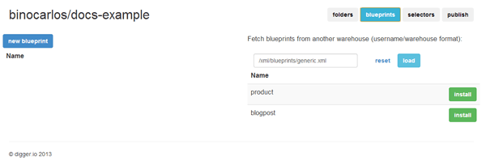
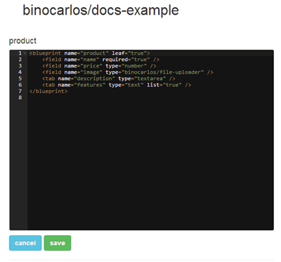
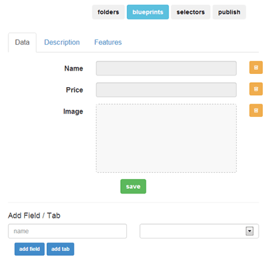

#Blueprints

One theme for a lot of NoSQL databases is the lack of a schema.

digger follows this trend and does not enforce strict rules about the data you can have - this is a good thing because it makes it very flexible.

One downside though is that digger dosn't know how to build forms for your users.

You can build forms yourself and write data using the JavaScript API.  Digger blueprints are a shortcut to the massive hassle that database forms can sometimes be.

###Adding Blueprints
Click on the 'Blueprints' tab form the warehouse gui and you will see the blueprints currently installed.

###Editing Blueprints
Edit the blueprint by typing into the XML editor on the left.

As you type the form preview will update itself.

You can also use the buttons below the preview to add fields.  The orange delete buttons will remove fields.

###Blueprint Format
Learning the blueprint format allows you to create felxible forms.

Read more in the [Blueprint Format](./developer-blueprints) section.