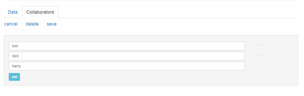

#Collaboration
    
###Client accounts

In order for your client to login and change some data - they will need an account.

There is no nesting of accounts in digger - you cannot add 'Your Client' as a user.

This is important because your client is a real person(s) and might have other developers working for them that also use digger.

To manage access to warehouses, digger uses a <strong>collaboration</strong> system very similar to github.

Once you add another digger username as a collaborator to a warehouse - they have full access and can write data.

###Creating a client account

One of the first questions to ask your client is 'do you have a digger account?'.

If yes then skip to the next section - if no then the client must create one.

We have added logins for most major social networks - your client can choose any to create an account - or they can register a normal digger account with a password.

Once they have confirmed their digger username (the same as you did when you registered) - they can now tell you their digger username.

*Soon we will add a feature that invites a new user via email to come and register and upon completion it will email you back what their username is (to automate this process).*

###Collaboration settings

Once you know your clients digger username - you can add them as a collaborator to your warehouse.

Login to your digger HQ and enter the warehouse you want your client to access.

Click the 'Settings' button and then the 'Collaborators' tab.

Type in the username your client gave to you.

You can revoke access at any time by removing the client username from the collaborator list of that warehouse.

###Complicated projects

It is not possible to create complex scenarios such as 'this user can only edit that folder'.

We encourage you to split your project across multiple warehouses at this point.

Not only does this enable you to assign the different access levels to the various warehouses - it also ensures your project does not grow into a seething monolothic tower of data and code (something engineers have realised is a very bad thing).

There is more about how to do this in the other guides (TODO - put a link to there innit).

