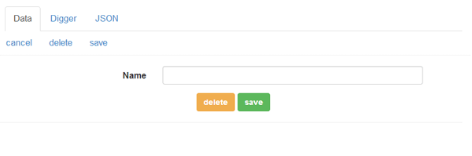
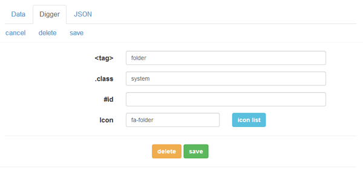
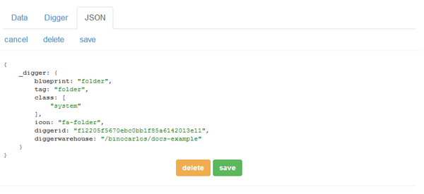
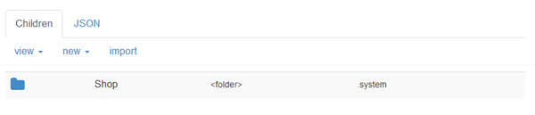

#Folders
A digger warehouse organizes it's data into folders.  

It works just like a normal file system where you put 'files' inside 'folders'.

The difference is that digger gives you a CSS query language to get data back out where a filesystem uses only the name.

Non-technical people are able to login and understand your database structure if you put stuff into sensible folders.

```
Login and add your products to the 'Furniture' folder.
```

Is an instruction most people can understand.  

Putting things into folders does not constrain you - the following query loads products regardless of what folder they are in:

```css
product[price<100]
```

###Adding Folders
When you open a warehouse - you will see the GUI.


Create folders to organize your data.

For example - if we want to create an Online Shop - we could create a folder called Shop and keep all our products below it.

Click the new -> folder button and the form will appear - enter the name and click 'Save'.



Each container will have a 'Digger' and 'JSON' tab also.

The digger tab allows you to set the 'tag', 'class' and 'id' of the container.



The JSON tab shows the data structure for the model.



Once you have clicked save - you will see the contents of the current folder.



###Folder Structure

For top-level folders that contain whole data sets - you can add an id so you can use #id selectors.

For example a #shop folder might container all products below it.

For folders that can be interchanged as groups - you can add classnames and treat them as a group.

For example our shop might contain several folders with the .inseason classname meaning this selector:

```css
folder.inseason product
```

Would load all products from all .inseason folders.