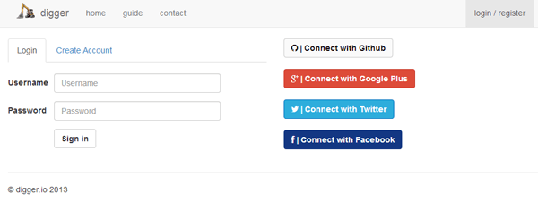
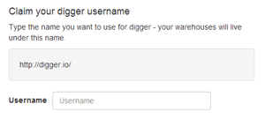
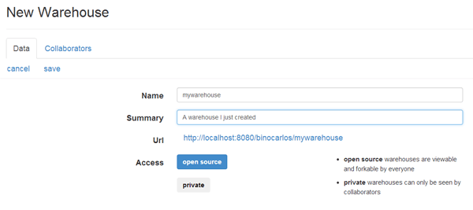
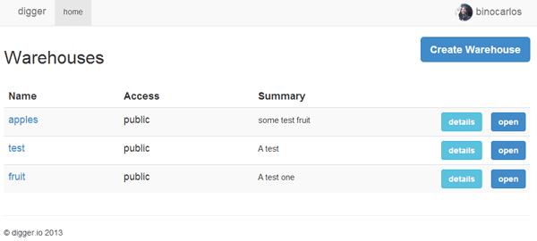

#Getting started

###Login

Head over the [login](/login) page and either register an account or login with one of the providers.

If you login with one of the providers, you will be asked to confirm your digger username after your first login.  Your digger username is where your warehouses will live and so is quite important (NOTE: you cannot change the username afterwards so choose carefully).

###digger HQ

Once you have logged in to your digger - your will see the **HQ** screen.  This is your central control panel that lets you:

 * Create new warehouses
 * Edit the data in warehouses
 * Collaborate with clients on warehouses
 * Write selectors for the data clients added

You will not have any warehouses yet but no fear - we will create one!

##Warehouses

###Create a warehouse

Click the 'Create Warehouse' button and a form will appear.

Type the name of your new warehouse - this cannot be the same as another warehouse and must be alphanumeric characters only.

The name of the warehouse becomes part of it's public URL - so if my username is **binocarlos** and my warehouse is called **fruit** then it's url would be:

 * [http://digger.io/binocarlos/fruit](http://digger.io/binocarlos/fruit)
    
This is the same naming scheme as Github.

###Access Control

Next - choose if it will be public or private:

 * **Public:** these warehouses can be read by everyone and written by collaborators.  Other digger users can <strong>fork</strong> a public warehouse and use it for their own purposes.

 * **Private:** these warehouses can only be read and written by collaborators.  Other digger users cannot see the warehouse.  They are good for creating private applications for clients.

Finally - enter a comment for this warehouse - it should describe what the purpose of the warehouse is.

Click 'create' and boom - you have a digger warehouse.

