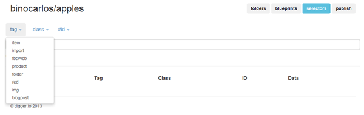

#Publish

Once you have created a warehouse and some data has been added - you probably want to get it loaded onto a web-page somewhere.

###Selectors

The first step is to know what selectors you will use to get some data.

To help you the 'Selectors' tab will show all tags, classnames and ids in the warehouse.



###HTML Tags

digger only needs for the script tag to be installed on the web-page and you have a **$digger** global variable that is ready to communicate.

The root url for the digger API is **http://digger.io/api/v1**

###JavaScript API

For the core JavaScript API all you need is **.js** or **.min.js** on the end.

The following will load the $digger object onto the current web-page:

```html
<script src="http://digger.io/api/v1.min.js"></script>
<script>
$digger('country').ship(function(countries){
	console.log(countries.count() + ' countries loaded');
})
</script>
```

###Auto-Connect

If you put the name of a warehouse into the script tag then the $digger object will automatically connect to that warehouse:

```html
<script src="http://digger.io/api/v1/binocarlos/countries.min.js"></script>
```

###Angular API

The angular API has several versions - choose the one that suits your application:

#### angularplus.min.js

This is the standard angular library with GUI and angular included.  This is the ideal option for HTML designers who don't want to worry about JavaScript but want to get data onto the page.

Here is a simple page using this to list all countries:

```html
<script src="http://digger.io/api/v1/binocarlos/countries.angularplus.min.js"></script>
<digger selector="country:sort(name)">
	<div digger-repeat>{{ $digger.title() }}</div>
</digger>
```

#### angularminplus.min.js

This is the same as above but does not include the GUI elements (like digger-form).


```html
<script src="http://digger.io/api/v1/binocarlos/countries.angularminplus.min.js"></script>
<digger selector="country:sort(name)">
	<div digger-repeat>{{ $digger.title() }}</div>
</digger>
```

#### angular.min.js

This includes the GUI elements but does not include angular.js itself. This is used when you have an existing angular application and just want to inject digger into it.


```html
<script src="http://digger.io/api/v1/binocarlos/countries.angular.min.js"></script>
<digger selector="country:sort(name)">
	<div digger-repeat>{{ $digger.title() }}</div>
</digger>
```

#### angularmin.min.js

The most basic version of the angular API - this does not include the GUI components and does not include angular itself.  This is so you can plug digger into an existing angular application where you will not need the GUI components.

```html
<script src="http://digger.io/api/v1/binocarlos/countries.angularmin.min.js"></script>
<digger selector="country:sort(name)">
	<div digger-repeat>{{ $digger.title() }}</div>
</digger>
```

###Multiple Warehouses

For angular - if you don't auto-connect to a warehouse you specify which warehouse to load from using the warehouse directive:

```html
<script src="http://digger.io/api/v1.angularmin.min.js"></script>
<digger warehouse="/binocarlos/countries" selector="country:sort(name)">
	<div digger-repeat>{{ $digger.title() }}</div>
</digger>
```